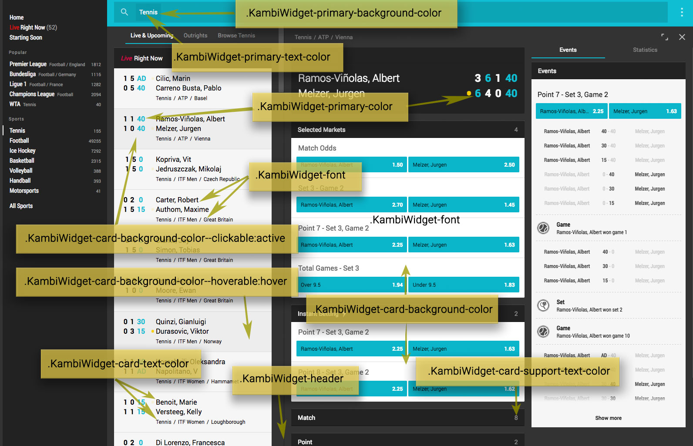

Styling should preferably be done by using Kambi classes whenever it is possible possible to keep the style consistent with the rest of the client.

Kambi client will load a `widgets.css` file which will have most of the classes needed to style a widget, matching the operator theme.
> Note: Kambi uses [BEM](http://getbem.com/) CSS naming convention

### Basic CSS classes

The CSS classes available by default are:

 - `KambiWidget-font` Default font that should be used.
 - `KambiWidget-primary-color` Default color for emphasized text
 - `KambiWidget-primary-background-color` Default background color for emphasis.
 - `KambiWidget-primary-text-color` Default color for emphasized text inside emphasized background
 - `KambiWidget-card-background-color` Default backrgound color for cards
    - `KambiWidget-card-background-color--hoverable` color when the the user hovers the element with the cursor
    - `KambiWidget-card-background-color--clickable` color for when the user clicks (or taps) on the element
 - `KambiWidget-card-text-color`  Default font color for text inside cards
 - `KambiWidget-card-support-text-color`  Alternative \(secondary\) font color for text inside cards
 - `KambiWidget-header ` Default styling \(background color, text color and font\) used for headers

> Please note that `coreLibrary` will add `KambiWidget-card-text-color`, `KambiWidget-card-background-color`, `KambiWidget-font` to the `<HTML>` tag

Here is a screenshot showing various classes in use:

